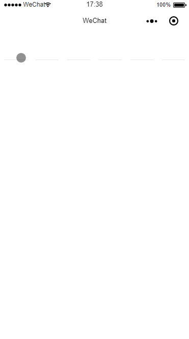
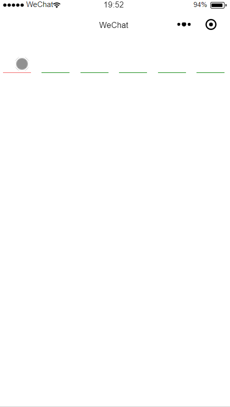

# sms-code
仿京东淘宝6位验证码输入
>本组件兼容暂未发现兼容问题，适用微信低版本基础库

## 效果演示
密码模式


短信验证码模式



## 使用方法
### 1.安装sms-code
```
npm install --save miniprogram-sms-code
```
### 2.在需要使用 sms-code 的页面 .json 中添加 sms-code 自定义组件配置
```json
{
  "usingComponents": {
    "sms-code": "miniprogram-sms-code"
  }
}
```
### 3.在需要使用 sms-code 的页面 .wxml 中引用 sms-code
```xml
<sms-code
  unactive-class="sms-unActive"
  active-class="sms-active"
  code-type="number"
  code-count="6"
  is-auto="{{ isAuto }}"
  bindchangeCode="changeCode">
</sms-code>
```

## 组件属性
### 1.属性
| 属性名                   | 类型         | 默认值                    | 是否必须    | 说明                                        |
|-------------------------|--------------|---------------------------|------------|---------------------------------------------|
| code-type               | String       | number                    | 否          | 组件类型，可取值：password（密码类型），number（数字类型），text（文本类型）|                      |
| code-count              | Number       | 6                         | 否          | 可输入长度，验证码或密码的长度                        |
| is-auto                 | Boolean      | false                     | 否          | 是否自动获取焦点 |
| unactive-class          | String       | 无                        | 否          | 输入块未输入时和失去焦点的样式类名，用于自定义样式|
| active-class            | String       | 无                        | 否          | 输入块有值时和获得焦点时的样式列名，用于自定义样式|
| dot-class               | String       | 无                        | 否          | 输入块密码状态样式，用于自定义样式|

### 2.方法
| 方法名                  |  是否必须    | 返回值                    | 说明                                        |
|-------------------------|------------- |---------------------------|---------------------------------------------|
| bindchangeCode          |  是          |e,输入框的值 e.detail.value| 监听输入值的变化                              |

## 栗子
### 覆盖默认样式
### 1.在引用组件的页面.wxml中，设置unactive-class 和 active-class
```xml
<view class="test">
  <sms-code unactive-class="sms-unActive" active-class="sms-active"  bindchangeCode="changeCode"></sms-code>
</view>
```
### 2.在引用组件的页面.wxss中，编写自己的样式代码
```css
/*自定义组件样式*/
.test .sms-unActive{
  border-color: green;
}

.test .sms-active{
  border-color: gold;
}
```
### 3.效果

